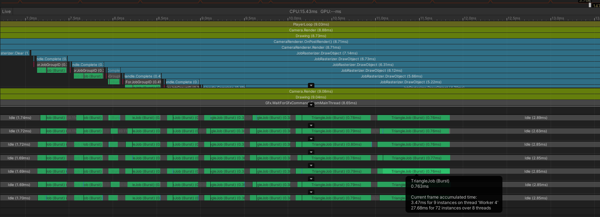
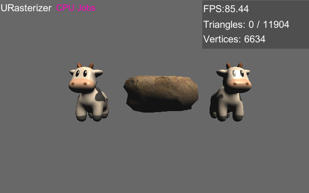

# URasterizer: Rasterizer Renderer on Unity Platform

This project implements a software rasterizer on the Unity platform. It leverages Unity's infrastructure to read models, textures, control GameObject transformations, and set camera parameters. The software rasterizer renders the scene onto a texture.

URasterizer consists of three independent rasterizer renderers:
* CPU Rasterizer: Fully implemented in C#, a single-threaded software rasterizer running on the CPU.
* CPU Job Rasterizer: Utilizes Unity's Job System and Burst Compiler, executing optimized rasterization code across multiple CPU cores for significantly improved performance.
* GPU Driven Rasterizer: Implements the entire rasterization pipeline using Compute shaders. The performance of the GPU Driven mode is comparable to direct Unity rendering.

The purpose of this project is to study and explore rasterization techniques, as well as utilize multi-core and GPGPU acceleration for rasterization. The GPU Driven algorithm is particularly advantageous for rendering small triangles but may not be suitable for general rasterization.

* GitHub repository for this project: https://github.com/happyfire/URasterizer
* If images are not visible, please visit the GitCode mirror repository: https://gitcode.net/n5/urasterizer

# Supported Features
(Some features are only supported by the CPU Rasterizer)
* Wireframe mode
* Frustum culling
* Clipping
* Backface culling
* Depth Test
* Barycentric coordinate rasterization
* Perspective-correct interpolation
* Visualized Depth Buffer
* MSAA (Multi-Sample Anti-Aliasing)
* Texture sampling modes: Nearest & Bilinear
* Blinn-Phong shading
* Visualized vertex colors
* Visualized normals
* Custom geometric primitives
* Custom vertex colors

# About Job System
Using the Job System alone can provide several times performance improvement over single-threaded calculations (in test scenes, FPS increased from 4 to 13). By parallelizing the vertex processing and triangle processing using Jobs, Unity Job System automatically schedules them to execute on multiple cores. With Burst compilation, the performance further improves (in test scenes, FPS increased to 85). In the profile, the execution time for each triangle job is less than 1ms with Burst, compared to over 20ms without Burst.

# About GPU Driven
Each rendering object organizes its corresponding input data in a Compute buffer. During rendering, three stages launch compute shader kernels for parallel computation. The intermediate results are also stored in the compute buffer, without reading back to CPU memory, and directly used by the next stage.
## Basic Pipeline
* Clear Frame Buffer stage: Assigns one thread per pixel for clearing operations.
* Vertex Processing stage: Assigns one thread per vertex for vertex transformations.
* Triangle Processing stage: Assigns one thread per triangle for clipping, backface culling, rasterization, and pixel shading.
## Existing Limitations
* Since threads are assigned per triangle, rendering very large triangles, such as two full-screen post-processing triangles, can cause a significant performance drop.
* Although each object is dispatched separately, the CPU does not wait for synchronization. Therefore, all triangles of all objects are processed in parallel, and rendering order cannot be specified. Transparent rendering is not supported.

# Project Screenshots
## Rendering Configuration Options

## CPU Rendering (Blinn-Phong shading)

## Job System & Burst Acceleration

## GPU

 Rendering
### Significantly improved FPS

### On the test machine, far from bottleneck, rendering more triangles does not affect the frame rate

## Wireframe mode with custom vertex colors

## Visualized vertex colors

## Visualized normals

## Visualized Depth Buffer

## MSAA
### MSAA disabled

### MSAA 4x

### MSAA disabled, local magnification

### MSAA 2x, local magnification

### MSAA 4x, local magnification

